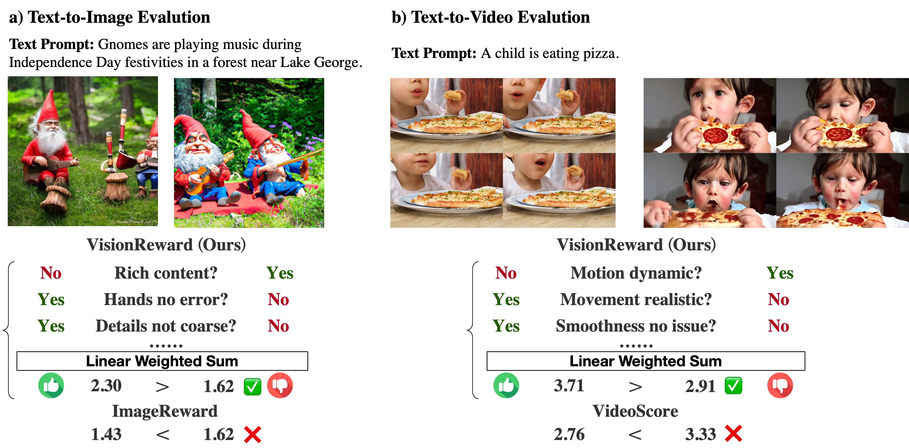

# VisionReward

<p align="center">
   📃 <a href="https://arxiv.org/abs/2412.21059" target="_blank">Paper</a> • 🖼 <a href="https://huggingface.co/datasets/THUDM/VisionRewardDB-Video" target="_blank">Dataset </a> • 🤗 <a href="https://huggingface.co/THUDM/VisionReward-Video" target="_blank">HF Repo</a> • 🌐 <a href="https://zhuanlan.zhihu.com/p/16481080277" target="_blank">中文博客</a> <br>
</p>

**VisionReward: Fine-Grained Multi-Dimensional Human Preference Learning for Image and Video Generation**

VisionReward is a fine-grained and multi-dimensional reward model. We decompose human preferences in images and videos into multiple dimensions, each represented by a series of judgment questions, linearly weighted and summed to an interpretable and accurate score. To address the challenges of video quality assessment, we systematically analyze various dynamic features of videos, which helps VisionReward surpass VideoScore by 17.2% and achieve top performance for video preference prediction.

<div align="center">
 
</div>

## Release


<table style="border-collapse: collapse; width: 100%; text-align: center; font-family: Arial, sans-serif; border: 2px solid #000;">
  <thead>
    <tr style="background-color: #f2f2f2;">
      <th style="border: 2px solid #000; padding: 8px; font-weight: bold;">📋 Model</th>
      <th style="border: 2px solid #000; padding: 8px; font-weight: bold;">🧠 Base Model</th>
      <th style="border: 2px solid #000; padding: 8px; font-weight: bold;">🤗 HF Link</th>
      <th style="border: 2px solid #000; padding: 8px; font-weight: bold;">🤖 MS Link</th>
    </tr>
  </thead>
  <tbody>
    <tr style="background-color: #f9f9f9;">
      <td style="border: 2px solid #000; padding: 8px;">VisionReward-Image</td>
      <td style="border: 2px solid #000; padding: 8px;"><a href="https://github.com/THUDM/CogVLM2" target="_blank">cogvlm2-llama3-chat-19B</a></td>
      <td style="border: 2px solid #000; padding: 8px;"><a href="https://huggingface.co/THUDM/VisionReward-Image" target="_blank">🤗 Huggingface</a></td>
      <td style="border: 2px solid #000; padding: 8px;">[🤖 ModelScope (coming soon)]()</td>
    </tr>
    <tr>
      <td style="border: 2px solid #000; padding: 8px;">VisionReward-Video</td>
      <td style="border: 2px solid #000; padding: 8px;"><a href="https://github.com/THUDM/CogVLM2" target="_blank">cogvlm2-video-llama3-chat</a></td>
      <td style="border: 2px solid #000; padding: 8px;"><a href="https://huggingface.co/THUDM/VisionReward-Video" target="_blank">🤗 Huggingface</a></td>
      <td style="border: 2px solid #000; padding: 8px;">[🤖 ModelScope (coming soon)]()</td>
    </tr>
  </tbody>
</table>

<br>

<table style="border-collapse: collapse; width: 100%; text-align: center; font-family: Arial, sans-serif; border: 2px solid #000;">
  <thead>
    <tr style="background-color: #f2f2f2;">
      <th style="border: 2px solid #000; padding: 8px; font-weight: bold;">📋 Dataset</th>
      <th style="border: 2px solid #000; padding: 8px; font-weight: bold;">📝 Annotation</th>
      <th style="border: 2px solid #000; padding: 8px; font-weight: bold;">🤗 HF Link</th>
      <th style="border: 2px solid #000; padding: 8px; font-weight: bold;">🤖 MS Link</th>
    </tr>
  </thead>
  <tbody>
    <tr style="background-color: #f9f9f9;">
      <td style="border: 2px solid #000; padding: 8px;">VisionRewardDB-Image</td>
      <td style="border: 2px solid #000; padding: 8px;">48K * 60 (dimensions)</td>
      <td style="border: 2px solid #000; padding: 8px;"><a href="https://huggingface.co/datasets/THUDM/VisionRewardDB-Image" target="_blank">🤗 Huggingface</a></td>
      <td style="border: 2px solid #000; padding: 8px;">[🤖 ModelScope (coming soon)]()</td>
    </tr>
    <tr>
      <td style="border: 2px solid #000; padding: 8px;">VisionRewardDB-Video</td>
      <td style="border: 2px solid #000; padding: 8px;">33K * 64 (dimensions)</td>
      <td style="border: 2px solid #000; padding: 8px;"><a href="https://huggingface.co/datasets/THUDM/VisionRewardDB-Video" target="_blank">🤗 Huggingface</a></td>
      <td style="border: 2px solid #000; padding: 8px;">[🤖 ModelScope (coming soon)]()</td>
    </tr>
  </tbody>
</table>

## Quick Start

### Set Up the Environment
Following the commands below to prepare the environment:
```
pip install -r requirements.txt
```


### VQA Example
Use the following code to perform a checklist query. You can view the available questions for images and videos in `VisionReward_Image/VisionReward_image_qa.txt` and `VisionReward_Video/VisionReward_video_qa.txt` respectively.
``` 
python inference-image.py --bf16 --question [[your_question]]
# input: image_path + prompt + question
# output: yes/no

python inference-video.py --question [[your_question]]
# input: video_path + prompt + question
# output: yes/no
```

### Using the model for scoring
Use the following code to score images/videos. The corresponding weights are in `VisionReward_Image/weight.json` and `VisionReward_Video/weight.json`.
``` 
python inference-image.py --bf16 --score 
# input: image_path + prompt
# output: score

python inference-video.py --score
# input: video_path + prompt
# output: score
```

### Using the model for comparing two videos
Use the following code to compare two videos. The corresponding weights are in `VisionReward-Video/weight.json`.
```
python inference-video.py --compare
# input: video_path1 + video_path2 + prompt
# output: better_video
```

## Demos of VisionReward

<p align="center">
    
</p>

## Citation

```
@misc{xu2024visionrewardfinegrainedmultidimensionalhuman,
      title={VisionReward: Fine-Grained Multi-Dimensional Human Preference Learning for Image and Video Generation}, 
      author={Jiazheng Xu and Yu Huang and Jiale Cheng and Yuanming Yang and Jiajun Xu and Yuan Wang and Wenbo Duan and Shen Yang and Qunlin Jin and Shurun Li and Jiayan Teng and Zhuoyi Yang and Wendi Zheng and Xiao Liu and Ming Ding and Xiaohan Zhang and Xiaotao Gu and Shiyu Huang and Minlie Huang and Jie Tang and Yuxiao Dong},
      year={2024},
      eprint={2412.21059},
      archivePrefix={arXiv},
      primaryClass={cs.CV},
      url={https://arxiv.org/abs/2412.21059}, 
}
```
