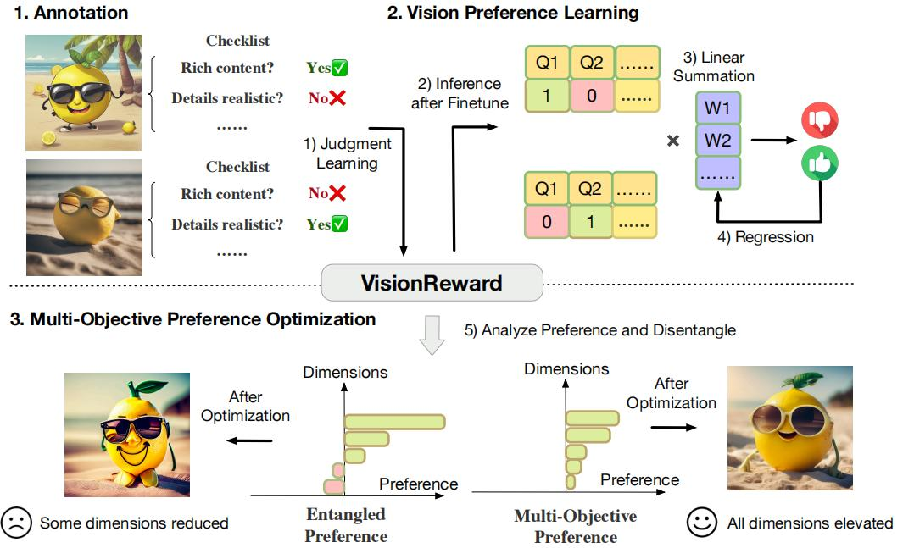

# VisionReward

<p align="center">
   📃 <a href="https://arxiv.org/abs/2412.21059" target="_blank">Paper</a> • 🖼 <a href="https://huggingface.co/datasets/THUDM/VisionRewardDB-Video" target="_blank">Dataset</a> • 🤗 <a href="https://huggingface.co/THUDM/VisionReward-Video" target="_blank">HF Repo</a> • 🌐 <a href="https://zhuanlan.zhihu.com/p/16481080277" target="_blank">中文博客</a> <br>
</p>

# **VisionReward: Fine-Grained Multi-Dimensional Human Preference Learning for Image and Video Generation**

VisionReward is a fine-grained, multi-dimensional reward model designed to capture human preferences in images and videos. By breaking down subjective judgments into interpretable dimensions with weighted scoring, it delivers precise and comprehensive evaluations. Excelling in video quality prediction, VisionReward sets a new benchmark by thoroughly analyzing dynamic video features.  

✨ **Key Highlights**:
- **SOTA Performance:** VisionReward achieves **64.0 (Tau)** / **72.1 (Diff)** on **[Monetbench](https://huggingface.co/datasets/THUDM/VisionRewardDB-Video/viewer/monetbench)**, surpassing **VideoScore** by 17.2% and setting a new **state-of-the-art**!  
- **Fine-Grained Multidimensional Dataset**: A rich, high-quality dataset with detailed annotations drives VisionReward’s precise understanding of human preferences across images and videos.
- **Interpretable Scoring:** The decomposed model structure ensures that every generated score is fully interpretable, paving new possibilities for content generation applications.  

<div align="center">
 
</div>

---

## 🚀 Release Information

### ✨ **Models**
<table style="border-collapse: collapse; width: 100%; text-align: center; font-family: Arial, sans-serif; border: 2px solid #000;">
  <thead>
    <tr style="background-color: #f2f2f2;">
      <th style="border: 2px solid #000; padding: 8px; font-weight: bold;">📋 Model</th>
      <th style="border: 2px solid #000; padding: 8px; font-weight: bold;">🧠 Base Model</th>
      <th style="border: 2px solid #000; padding: 8px; font-weight: bold;">🤗 HF Link</th>
      <th style="border: 2px solid #000; padding: 8px; font-weight: bold;">🤖 MS Link</th>
    </tr>
  </thead>
  <tbody>
    <tr style="background-color: #f9f9f9;">
      <td style="border: 2px solid #000; padding: 8px;">VisionReward-Image</td>
      <td style="border: 2px solid #000; padding: 8px;"><a href="https://github.com/THUDM/CogVLM2" target="_blank">cogvlm2-llama3-chat-19B</a></td>
      <td style="border: 2px solid #000; padding: 8px;"><a href="https://huggingface.co/THUDM/VisionReward-Image" target="_blank">🤗 Huggingface</a></td>
      <td style="border: 2px solid #000; padding: 8px;"><a href="https://huggingface.co/THUDM/VisionReward-Image" target="_blank">🤖 ModelScope (coming soon)</a></td>
    </tr>
    <tr style="background-color: #f9f9f9;">
      <td style="border: 2px solid #000; padding: 8px;">VisionReward-Video</td>
      <td style="border: 2px solid #000; padding: 8px;"><a href="https://github.com/THUDM/CogVLM2" target="_blank">cogvlm2-video-llama3-chat</a></td>
      <td style="border: 2px solid #000; padding: 8px;"><a href="https://huggingface.co/THUDM/VisionReward-Video" target="_blank">🤗 Huggingface</a></td>
      <td style="border: 2px solid #000; padding: 8px;"><a href="https://huggingface.co/THUDM/VisionReward-Video" target="_blank">🤖 ModelScope (coming soon)</a></td>
    </tr>
  </tbody>
</table>

---

### 🎨 **Datasets**
<table style="border-collapse: collapse; width: 100%; text-align: center; font-family: Arial, sans-serif; border: 2px solid #000;">
  <thead>
    <tr style="background-color: #f2f2f2;">
      <th style="border: 2px solid #000; padding: 8px; font-weight: bold;">📋 Dataset</th>
      <th style="border: 2px solid #000; padding: 8px; font-weight: bold;">📝 Annotation</th>
      <th style="border: 2px solid #000; padding: 8px; font-weight: bold;">🤗 HF Link</th>
      <th style="border: 2px solid #000; padding: 8px; font-weight: bold;">🤖 MS Link</th>
    </tr>
  </thead>
  <tbody>
    <tr style="background-color: #f9f9f9;">
      <td style="border: 2px solid #000; padding: 8px;">VisionRewardDB-Image</td>
      <td style="border: 2px solid #000; padding: 8px;">48K * 60 (dimensions)</td>
      <td style="border: 2px solid #000; padding: 8px;"><a href="https://huggingface.co/datasets/THUDM/VisionRewardDB-Image" target="_blank">🤗 Huggingface</a></td>
      <td style="border: 2px solid #000; padding: 8px;"><a href="https://huggingface.co/datasets/THUDM/VisionRewardDB-Image" target="_blank">🤖 ModelScope (coming soon)</a></td>
    </tr>
    <tr style="background-color: #f9f9f9;">
      <td style="border: 2px solid #000; padding: 8px;">VisionRewardDB-Video</td>
      <td style="border: 2px solid #000; padding: 8px;">33K * 64 (dimensions)</td>
      <td style="border: 2px solid #000; padding: 8px;"><a href="https://huggingface.co/datasets/THUDM/VisionRewardDB-Video" target="_blank">🤗 Huggingface</a></td>
      <td style="border: 2px solid #000; padding: 8px;"><a href="https://huggingface.co/datasets/THUDM/VisionRewardDB-Video" target="_blank">🤖 ModelScope (coming soon)</a></td>
    </tr>
  </tbody>
</table>

---

## 🔧 Quick Start

### **Set Up the Environment**
Run the following commands to install dependencies:
```
pip install -r requirements.txt
```

---

### **Run VQA (Vision-Question-Answering)**
Perform a checklist query using the commands below. Available image and video questions can be found in `VisionReward_Image/VisionReward_image_qa.txt` and `VisionReward_Video/VisionReward_video_qa.txt`, respectively.
```
# For Image QA
python inference-image.py --bf16 --question [[your_question]]
# Input: image_path + prompt + question
# Output: yes/no

# For Video QA
python inference-video.py --question [[your_question]]
# Input: video_path + prompt + question
# Output: yes/no
```

---

### **Scoring with VisionReward**
Calculate scores for images/videos with the following commands. The corresponding weights are in `VisionReward_Image/weight.json` and `VisionReward_Video/weight.json`.
```
# Scoring an Image
python inference-image.py --bf16 --score 
# Input: image_path + prompt
# Output: score

# Scoring a Video
python inference-video.py --score
# Input: video_path + prompt
# Output: score
```

---

### **Compare Two Videos**
Directly compare the quality of two videos, leveraging the weights in `VisionReward_Video/weight.json`.
```
python inference-video.py --compare
# Input: video_path1 + video_path2 + prompt
# Output: better_video
```

---


<p align="center">
    
</p>

---

## 📚 Citation
If you find VisionReward helpful, please cite us:
```
@misc{xu2024visionrewardfinegrainedmultidimensionalhuman,
      title={VisionReward: Fine-Grained Multi-Dimensional Human Preference Learning for Image and Video Generation}, 
      author={Jiazheng Xu and Yu Huang and Jiale Cheng and Yuanming Yang and Jiajun Xu and Yuan Wang and Wenbo Duan and Shen Yang and Qunlin Jin and Shurun Li and Jiayan Teng and Zhuoyi Yang and Wendi Zheng and Xiao Liu and Ming Ding and Xiaohan Zhang and Xiaotao Gu and Shiyu Huang and Minlie Huang and Jie Tang and Yuxiao Dong},
      year={2024},
      eprint={2412.21059},
      archivePrefix={arXiv},
      primaryClass={cs.CV},
      url={https://arxiv.org/abs/2412.21059}, 
}
```